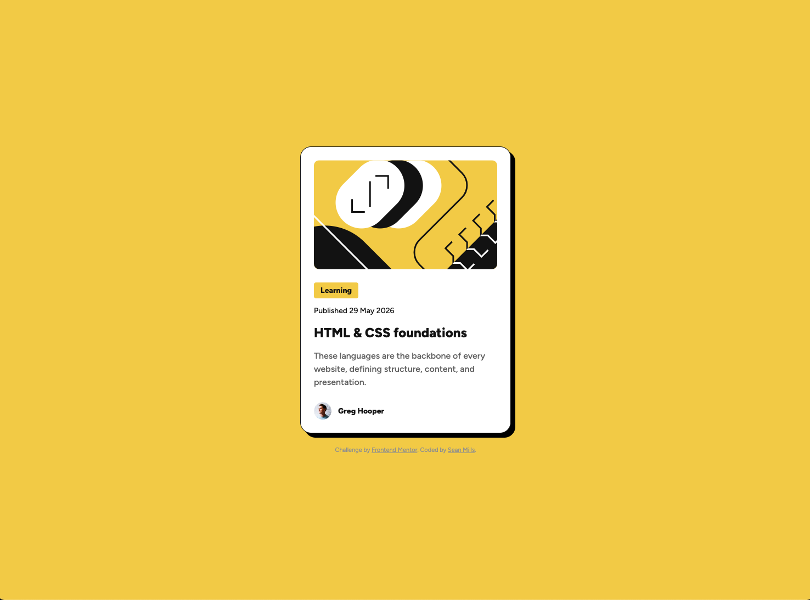

# Frontend Mentor - Blog preview card

This is a solution to the [Blog Preview Card challenge on Frontend Mentor](https://www.frontendmentor.io/challenges/blog-preview-card-ckPaj01IcS). Frontend Mentor challenges help you improve your coding skills by building realistic projects.

### Screenshot

### Links

- [Live Site](https://smills1020.github.io/frontend-mentor-blog-preview-card/)

### Built with

- Semantic HTML5 markup
- CSS custom properties
- Flexbox
